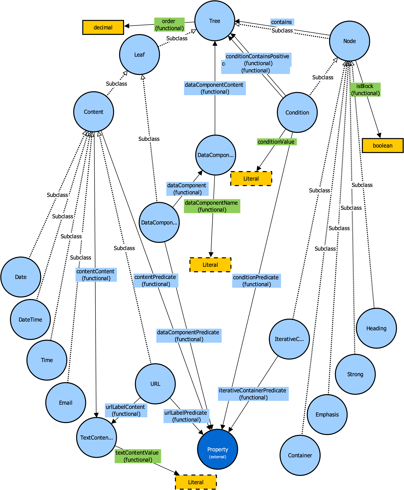

# View Ontology

This is a view ontology used in Datenzee project.

The View Ontology was published in: 

Slifka, Jan, Knaisl, Vojtěch, and Pergl, Robert. (2024). **Evolvable transformation of knowledge graphs into human-oriented formats**. *Journal of Intelligent Information Systems*, 62(2), 295–316. https://doi.org/10.1007/s10844-023-00809-w

## Overview of the Ontology

## License

This project is licensed under the Apache License v2.0 - see the
[LICENSE](LICENSE) file for more details.
